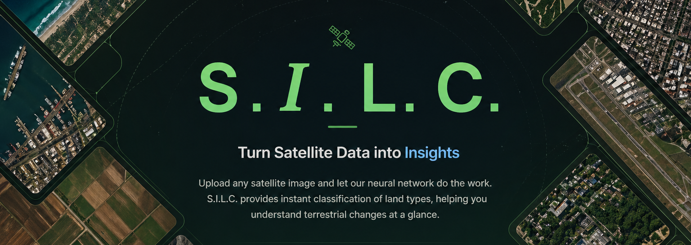

# 🛰️ S.I.L.C. - Satellite Image Land Classification

S.I.L.C. is a full-stack machine learning system that classifies land types from satellite imagery using a fine-tuned EfficientNet-B0 model trained on the EuroSAT RGB dataset.

Users can upload real-world satellite images and receive top-3 predictions with confidence scores, alongside a visual comparison showing how the model preprocesses the image through its 64×64 pipeline.

---

## 🚀 Live Demo

👉 [Try the app here](https://aaryangotad-silc.hf.space)

Upload a satellite image or try one of the provided sample images.

---

## ✨ Features

- 🧠 **EfficientNet-B0** image classifier - 10 land-use classes
- 📊 **Top-3 predictions** with confidence scores
- 🖼️ **Visual comparison** - original image alongside the model's 64×64 preprocessed input

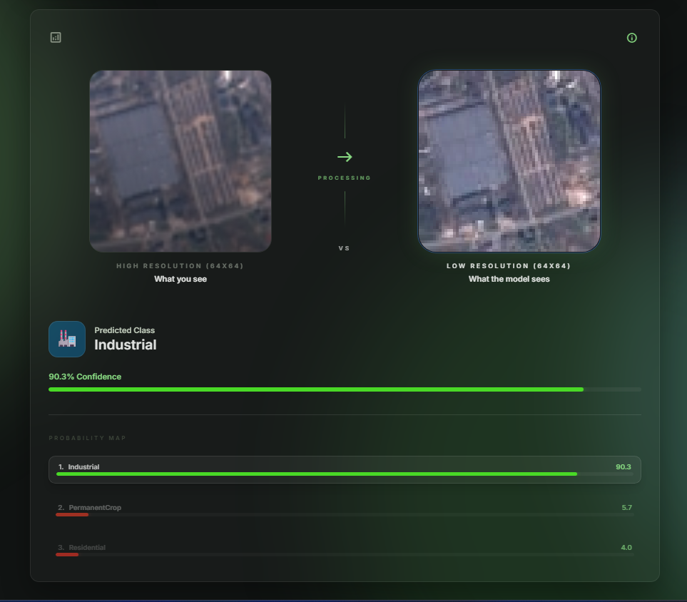

- ⚡ **Real-time inference** via Flask API
- 🎨 **Clean, responsive UI** built with Tailwind CSS - supports dark/light mode


The UI was built from scratch in HTML, Tailwind CSS, and vanilla JavaScript, no frameworks. I used [Google Stitch](https://stitch.withgoogle.com/) to sketch the initial layout and structure.

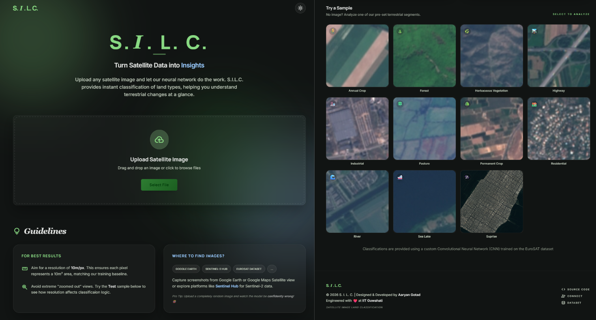
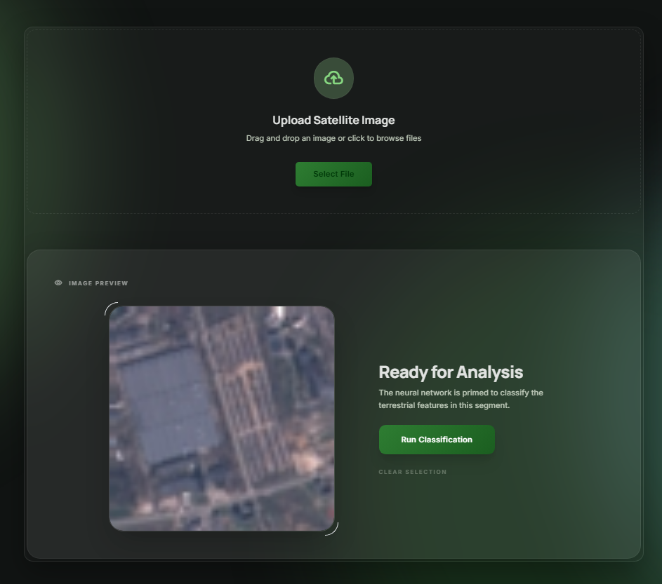

*(👆 Preview window shown when an image is selected or uploaded)*

The UI is fully responsive and works equally well on mobile screens.

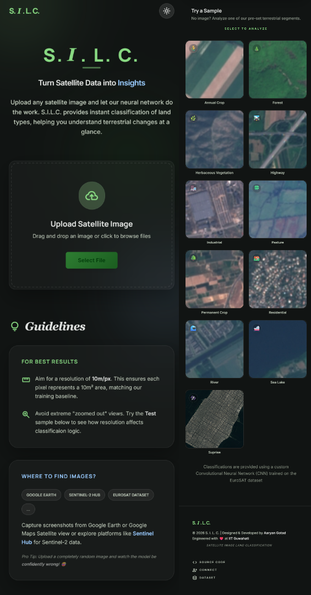

> 🔑 **Note:** UI screenshots above are stitched side-by-side for display purposes - actual section placement will differ in the live app.

- 🐳 **Dockerized deployment** on Hugging Face Spaces

---

## 🧠 Model Details

All models were built with TensorFlow/Keras. 

### Dataset

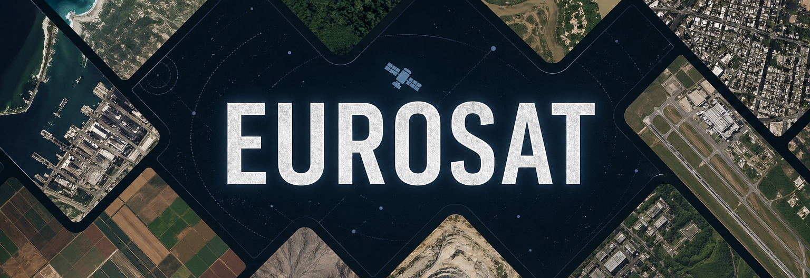

All models were trained on the [EuroSAT](https://www.kaggle.com/datasets/apollo2506/eurosat-dataset) RGB dataset, **27,000 satellite images** across **10 land-use classes**:

| Split | Images |
|-------|--------|
| Train | 18,900 |
| Validation | 5,400 |
| Test | 2,700 |

#### Why 64×64?

All EuroSAT images are natively **64×64 pixels**, captured at a ground sampling distance of **10 metres per pixel**, meaning each pixel represents a 10m × 10m patch of land. This is a relatively low resolution, which is part of what makes the task challenging, and also a core reason why fine-grained details can be lost during inference. The OOD section below goes into this in detail.

---

### Custom CNN Baseline

I began with a custom CNN to establish a performance baseline.

**Architecture:**
- Input (64×64)
- Rescaling (pixel values to [0, 1])
- Data Augmentation (Sequential)
- Three convolutional blocks (32 → 64 → 128 filters, kernel size 3, same padding, ReLU, BatchNorm, MaxPool)
- Global Average Pooling
- Dense (10 units, softmax)

**Training config:** Categorical cross-entropy loss, Adam optimizer (lr=0.001), 10 epochs.

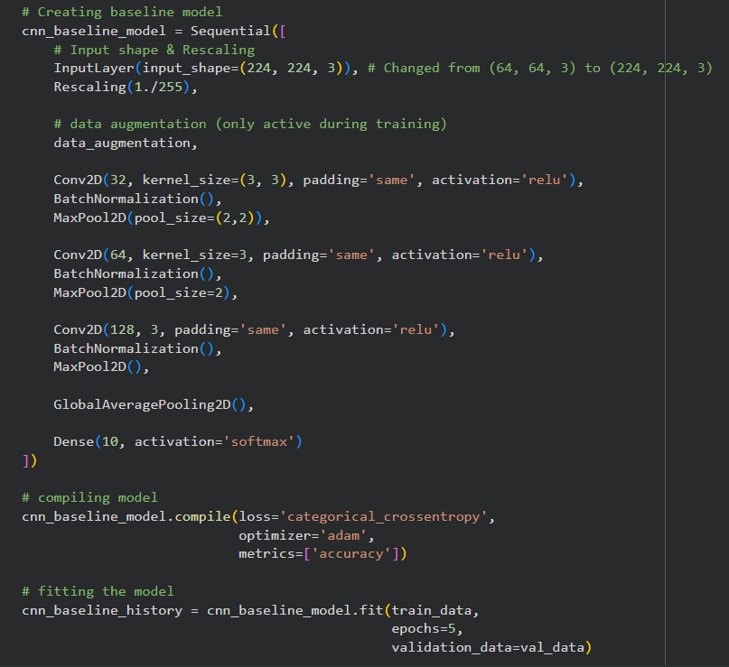

As expected, the model began overfitting from the second epoch:

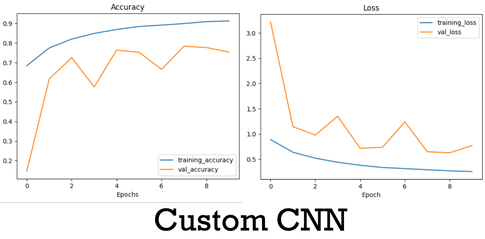

| Metric | Training | Validation |
|--------|----------|------------|
| Accuracy | 91.11% | 75.33% |
| Loss | 25.56% | 77.00% |

A ~16% accuracy gap between training and validation made it clear a stronger architecture was needed, which led me to transfer learning.

---

### Transfer Learning - Feature Extraction

I chose **EfficientNet-B0** as the base model. The reasoning was practical: it is compact enough to train and fine-tune on free cloud compute, and deployable without heavy quantization.

The base model weights were frozen, and a custom classification head was added on top using the Functional API.

**Architecture:**
- Input (64×64)
- EfficientNet-B0 base (frozen, no top layer)
- Global Average Pooling
- Batch Normalization
- Dense (128 units, ReLU)
- Dropout (0.5)
- Dense (10 units, softmax)

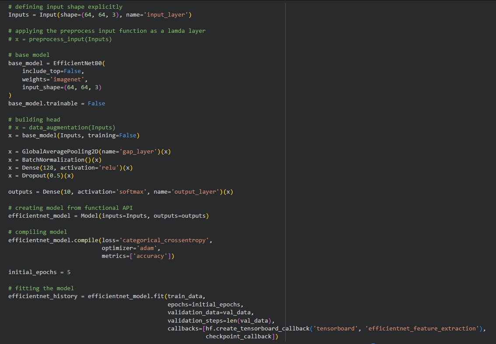

Trained for 5 epochs with a checkpoint callback (weights saved for the fine-tuning phase).

| Metric | Training | Validation |
|--------|----------|------------|
| Accuracy | 92.10% | 92.33% |
| Loss | 22.92% | 24.71% |

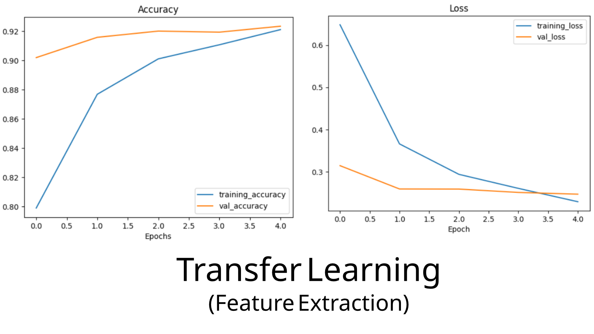

Training and validation metrics stayed closely aligned, a strong sign of good generalization. Data augmentation was tested here but actually hurt performance, so it was removed.

---

### Fine-Tuning

After loading the best checkpoint weights from the feature extraction phase, I unfroze the **top 10 layers** of the EfficientNet-B0 base and continued training with a **10× lower learning rate** for 5 additional epochs.

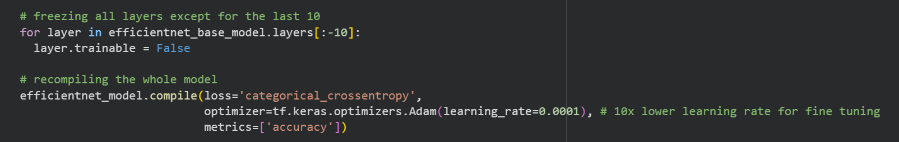
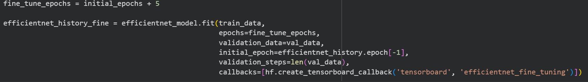

The model dipped in the first epoch after unfreezing, expected behaviour, but recovered quickly.

| Metric | Training | Validation |
|--------|----------|------------|
| Accuracy | 96.12% | 93.89% |
| Loss | 11.43% | 21.40% |

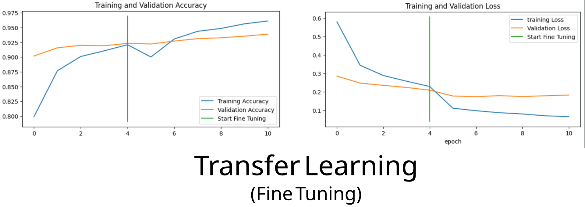

The widening gap between training and validation accuracy indicated mild overfitting. The natural fix: more data. I retrained the same architecture on the combined train + validation set, then evaluated on the held-out test set.

| Metric | Training | Test |
|--------|----------|------|
| Accuracy | 97.85% | 95.11% |
| Loss | 6.46% | 17.40% |

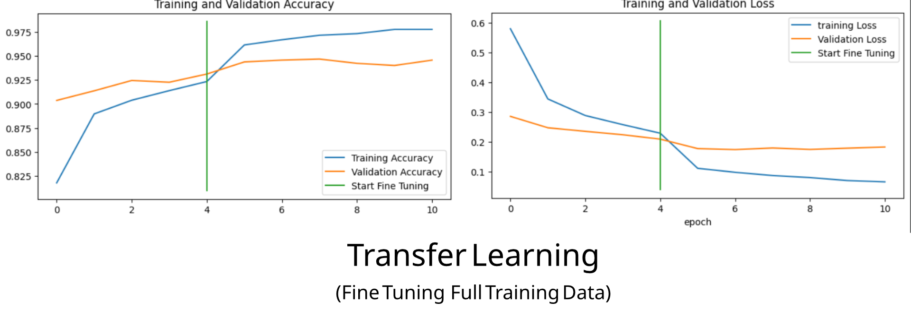

I also experimented with unfreezing 10 additional layers, but performance dropped by ~1%. At 95% test accuracy, the accuracy-vs-compute trade-off clearly favoured stopping here.

---

### 📊 Final Model Performance

| Split | Accuracy |
|-------|----------|
| Training | 97.85% |
| Test | 95.11% |

These metrics were measured on the **held-out test set (2,700 images)**, data the model had never seen during training or validation.

---

### 🔍 Confusion Insights

The model performs strongly across all 10 classes, with **Residential** achieving the highest per-class accuracy at **98.7%**.

The main source of confusion is between **River** and **Highway**. Both share a similar visual structure, a long, narrow strip running through the image, differing mainly in colour (blue-green for rivers, grey for highways). Out of 250 River test images, 225 were classified correctly, but 13 were misclassified as Highway.

Similar confusion occurs between **Forest**, **HerbaceousVegetation**, **Pasture**, and occasionally **SeaLake**, where texture patterns overlap significantly. This points to a fundamental characteristic of how these models work: they learn visual patterns, not semantic meaning. The model sees "long strip → possibly highway," rather than understanding what a river or a highway actually *is*. The OOD section below explores why this matters beyond just the confusion matrix.

**Strong performance on:**
- Residential - 98.7%
- Sea/Lake - 98.0%

**Primary confusion:**
- River ↔ Highway (linear pattern similarity)

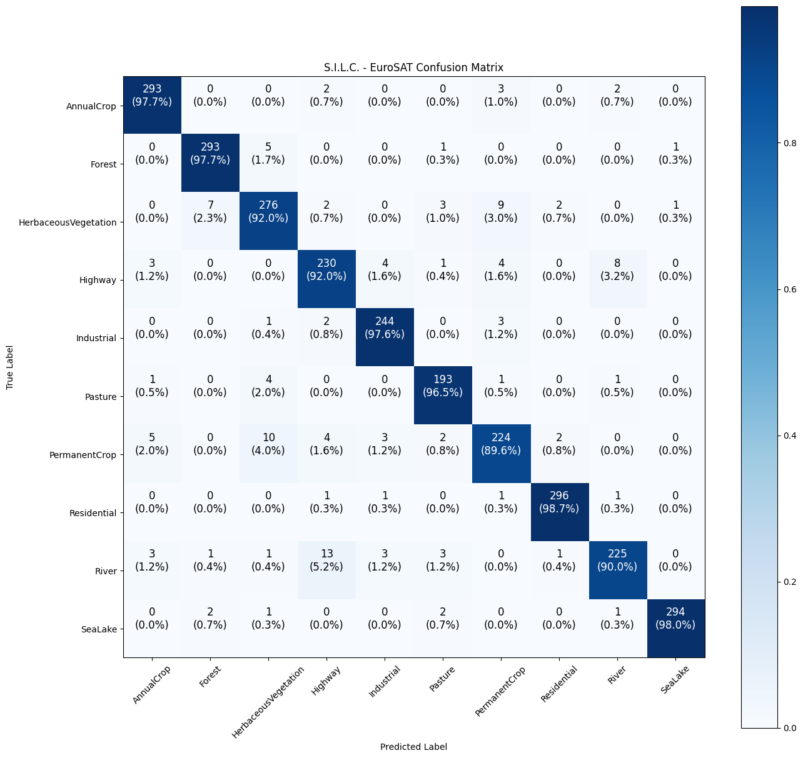

---

## 🌍 Out-of-Domain (OOD) Data

This section explains one of the most common points of confusion when using S.I.L.C., and arguably the most important thing to understand about how this model (and most classifiers like it) actually behaves.

---

Suppose you upload a top-down image that is clearly one of the 10 supported classes, say, a *forest*:

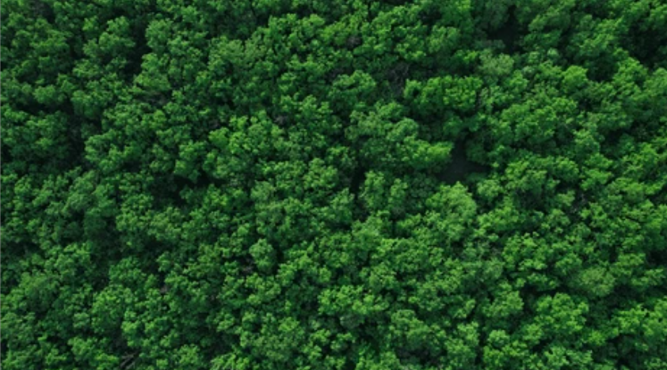

...but the model confidently predicts a completely different class, like *Residential*:

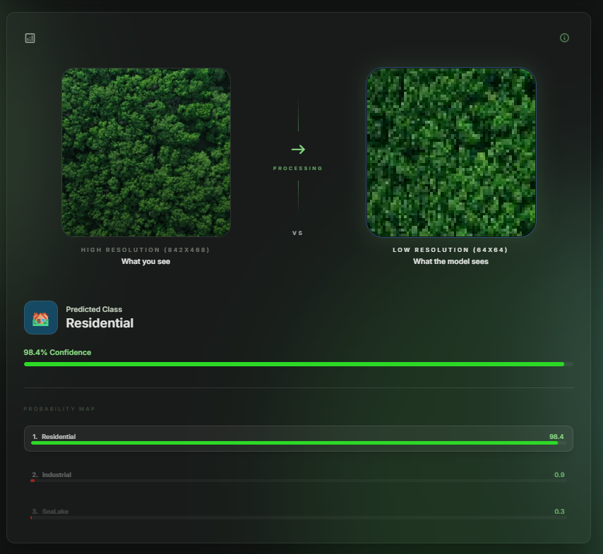

This might make you think the model is broken or poorly trained. It isn't.

Neural networks are notorious for being ***confidently wrong*** when given inputs they haven't encountered during training. You may have seen a version of this with LLMs ChatGPT, Gemini, or Claude sometimes state something obviously incorrect with complete conviction. That phenomenon is called **hallucination**. What happens here is the same idea, just at a much smaller scale.

The root cause is the output layer: it uses **softmax activation**.

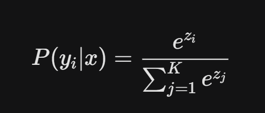

Softmax forces all output probabilities to sum to exactly 1 (100%). This means the model *must always* commit to one of the 10 classes, it has no mechanism to say "I don't know." Whatever input you give it, it will always return a confident-looking answer.

---

This becomes especially visible with high-resolution, real-world images. Take a city grid photo:

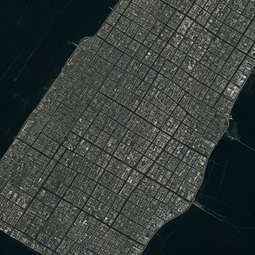

Since the model expects 64×64 inputs, any image must be downscaled before inference. Downscaling inevitably destroys fine detail, there's no way around it.

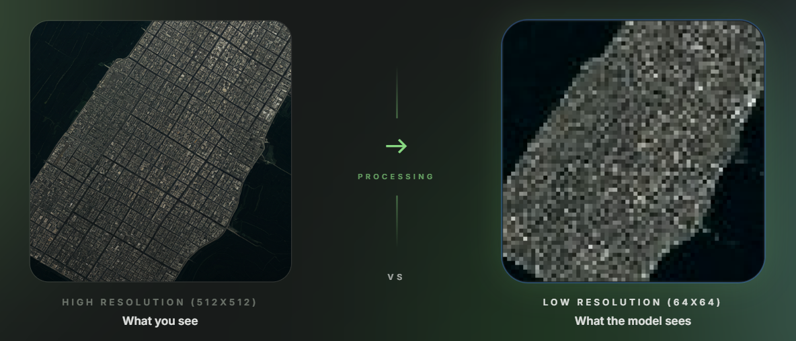

After downscaling, the texture and pattern of this city grid ends up looking remarkably similar to Annual Crop imagery. So the model classifies it as *AnnualCrop*, confidently.

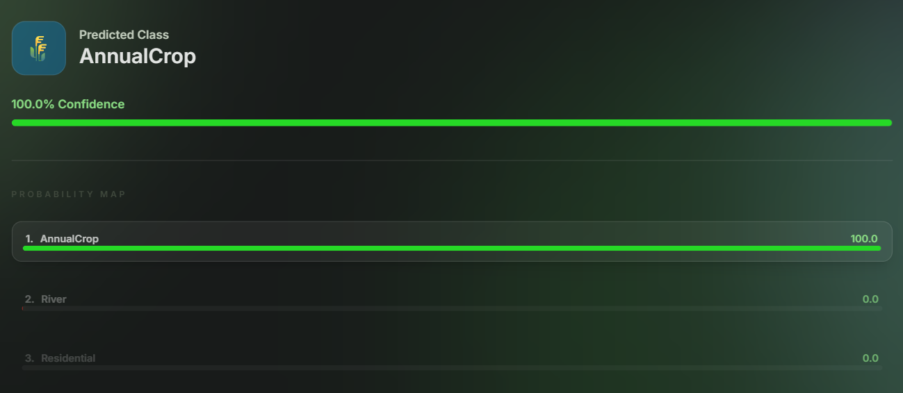

---

### Possible Mitigations

- **Train at a higher input resolution** - e.g. 128×128 instead of 64×64. I attempted 224×224 but ran into VRAM limitations on free compute, so I stayed with the native EuroSAT resolution to keep things manageable.
- **Train on a more diverse dataset** - adding non-EuroSAT imagery would help the model learn what "out-of-domain" looks like.
- **Patch-based classification** - divide the input into fixed-size patches, classify each independently, and average the results.

I decided not to pursue any of these for this version, and I think that was the right call. This is my first ML project, and I'd rather do one thing well than chase every improvement until the project collapses under its own scope. In software development and ML, there's a name for that trap: **feature creep**, the tendency for a project to grow indefinitely until it becomes a burden rather than a useful thing.

What I *did* add, based on some feedback, is a **confidence threshold** (currently set to 85%). If the model's top prediction falls below this threshold, the UI skips the class label entirely and displays a message indicating that the image does not appear to be a satellite image. It isn't a complete solution, but it prevents the most obviously wrong predictions from being presented as if they were reliable.

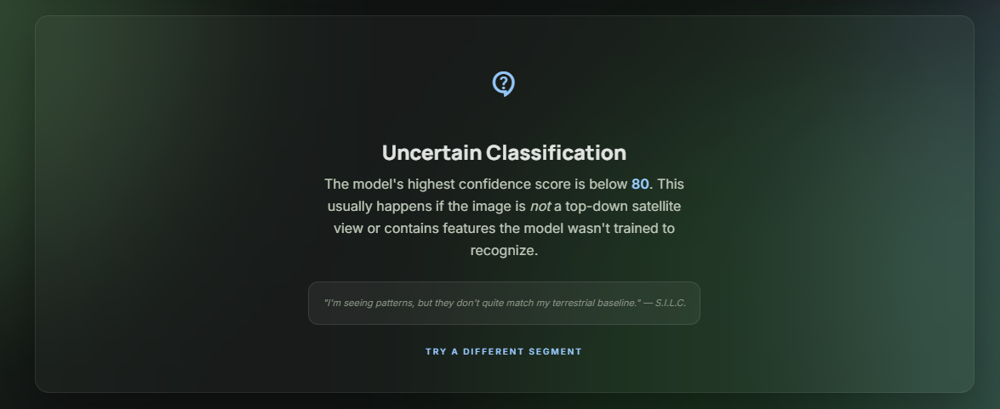

---

## ⚠️ Limitations

- **Low input resolution (64×64):** Fine-grained detail is unavoidably lost during downscaling. The OOD section above walks through exactly why this happens and what it looks like in practice.
- **Texture-based classification:** The model learns visual patterns, not semantic concepts, the root cause of both the River ↔ Highway confusion and the OOD behaviour described above.
- **Fixed class set:** The model can only output one of the 10 EuroSAT classes. Images that don't belong to any of them (snow, desert, open ocean, urban sprawl) will still receive a prediction, just not a reliable one.

---

## ⚙️ System Architecture

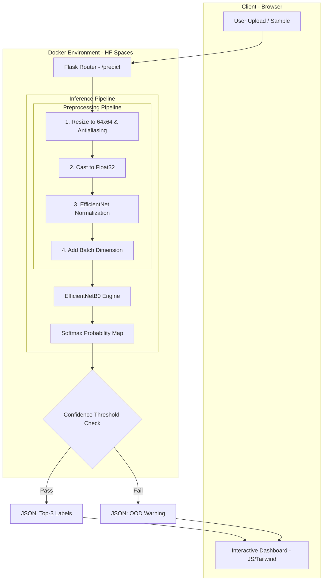
```mermaid
graph TD
    subgraph Client_Side [Client - Browser]
        A[User Upload / Sample]
        I[Interactive Dashboard - JS/Tailwind]
    end

    subgraph Docker_Runtime [Docker Environment - HF Spaces]
        B[Flask Router - /predict]
        
        subgraph AI_Pipeline [Inference Pipeline]
            subgraph Preprocessing [Preprocessing Pipeline]
                C1[1. Resize to 64x64 & Antialiasing]
                C2[2. Cast to Float32]
                C3[3. EfficientNet Normalization]
                C4[4. Add Batch Dimension]
            end
            
            D[EfficientNetB0 Engine]
            E[Softmax Probability Map]
        end
        
        F{Confidence Threshold Check}
    end

    A --> B
    B --> C1
    C1 --> C2
    C2 --> C3
    C3 --> C4
    C4 --> D
    D --> E
    E --> F
    F -->|Pass| G[JSON: Top-3 Labels]
    F -->|Fail| H[JSON: OOD Warning]
    G --> I
    H --> I
```

### 🔄 Preprocessing Pipeline

1. Resize to 64×64 with aspect ratio preserved (bilinear interpolation)
2. Antialiasing applied during resize
3. Cast pixel values to `float32`
4. Apply EfficientNet-specific input preprocessing
5. Add batch dimension to image tensor
6. Output: Image tensor ready for inference

### 🔮 Prediction Pipeline

- Model inference via TensorFlow/Keras
- Top-3 predictions extracted using the `get_top_k_predictions` helper
- Confidence threshold applied before returning results to the UI

---

## 🌐 API Reference

The Flask backend exposes the following endpoint:

### `POST /predict`

Accepts a satellite image and returns the top-3 predicted land classes with confidence scores.

**Request**

```
Content-Type: multipart/form-data
Body: image file (JPG, PNG)
```

**Response**

```json
[
   { "label": "Residential", "confidence": 94 },
   { "label": "Industrial",  "confidence": 4 },
   { "label": "Highway",     "confidence": 1 }
]
```

> *Note: Confidence values are returned as percentages (integer form).*

**Example (Python)**

```python
import requests

with open("satellite.jpg", "rb") as f:
    response = requests.post(
        "https://aaryangotad-silc.hf.space/predict",
        files={"image": f}
    )

print(response.json())
```

---

## 🐳 Deployment

- **Platform:** Hugging Face Spaces 🤗
- **Runtime:** Docker (16 GB RAM)

### Key Challenges Solved

- **Keras 3 compatibility** (`quantization_config` key error) → patched at runtime on load
- **Read-only filesystem** → session/temp storage redirected to `/tmp`
- **Model loading** → optimized for inference-only use (no training graph)

### Tech Stack

| Layer | Technology |
|-------|------------|
| Backend | Flask |
| ML | TensorFlow / Keras |
| Frontend | HTML, Tailwind CSS, Vanilla JavaScript |
| Deployment | Docker on Hugging Face Spaces |

---

## 💡 Key Learnings

This was my first end-to-end ML project, and the process taught me more than I expected:

- **Transfer learning is powerful, but not magic.** Freezing the base and training a custom head got me to ~92% accuracy in very few epochs. Fine-tuning pushed it to 95%, but required careful learning rate control to avoid breaking the pretrained weights.
- **More data beats more complexity**, at least at this scale. Training on the full train + validation set improved generalization more than any architectural change.
- **The confusion matrix tells the real story.** Aggregate accuracy looked great, but the matrix revealed the River ↔ Highway confusion that raw numbers couldn't, a reminder to always look deeper than the headline metric.
- **Deployment has its own learning curve.** Keras 3 compatibility issues, read-only filesystems on Hugging Face Spaces, and Docker configuration all required debugging that had nothing to do with model training.
- **UI/UX matters.** Building an intuitive frontend that works on both desktop and mobile was harder than expected, and just as rewarding as getting the model to work.

---

## 🛠️ Local Setup

1. **Clone the repository**
   ```bash
   git clone https://github.com/AaryanGotad/S.I.L.C..git
   cd S.I.L.C.
   ```

2. **Install dependencies**
   ```bash
   pip install -r requirements.txt
   ```

3. **Run the application**
   ```bash
   python app.py
   ```

The app will be available at `http://localhost:5000` by default.

---

## 📂 File Structure

```
S.I.L.C.  ← top-level folder
├── model/
│   └── effnet_model.keras       ← Trained model
├── static/
│   ├── css/
│   │   └── style.css            ← Stylesheet
│   ├── js/
│   │   └── script.js            ← Frontend logic
|   └── docImages/               ← Images used by README
|    |   ├── TensorFlow_logo.svg.png
|    │   ├── architecture.png
|    │   ├── city_grid.png
|    │   ├── city_grid_comparison.png
|    │   ├── city_grid_results.png
|    │   ├── cnn_training_metrics.png
|    │   ├── confusion_matrix.png
|    │   ├── docker_logo.png
|    │   ├── eurosat_cover.png
|    │   ├── fine_train_full_metrics.png
|    │   ├── fine_train_metrics.png
|    │   ├── forest.png
|    │   ├── forest_results.png
|    │   ├── homepage.png
|    │   ├── mobile_homepage.png
|    │   ├── preview_window.png
|    │   ├── resolution.png
|    │   ├── silc_cover.png
|    │   ├── softmax.png
|    │   ├── stitch_logo.png
|    │   ├── threshold.png
|    │   ├── transfer_arch.png
|    │   ├── transfer_learning_fine_1.png
|    │   ├── transfer_learning_fine_2.png
|    │   ├── transfer_learning_metrics.png
|    │   └── visual_comparison.png      
|    ├── sample_images/               ← One sample per class (+ surprise image)
|    │   ├── AnnualCrop.jpg
|    │   ├── Forest.jpg
|    │   ├── HerbaceousVegetation.jpg
|    │   ├── Highway.jpg
|    │   ├── Industrial.jpg
|    │   ├── Pasture.jpg
|    │   ├── PermanentCrop.jpg
|    │   ├── Residential.jpg
|    │   ├── River.jpg
|    │   ├── SeaLake.jpg
|    │   └── test.png                 ← Surprise class image
├── templates/
│   └── index.html               ← Frontend
├── app.py                       ← Main Flask application
├── helper.py                    ← Preprocessing and top-k prediction helpers
├── requirements.txt             ← Python dependencies
├── Dockerfile                   ← Docker configuration
├── Procfile                     ← Configuration for hosting services (e.g. Render)
└── README.md                    ← This file
```

---

## 📄 License

See [LICENSE](LICENSE) for details.
